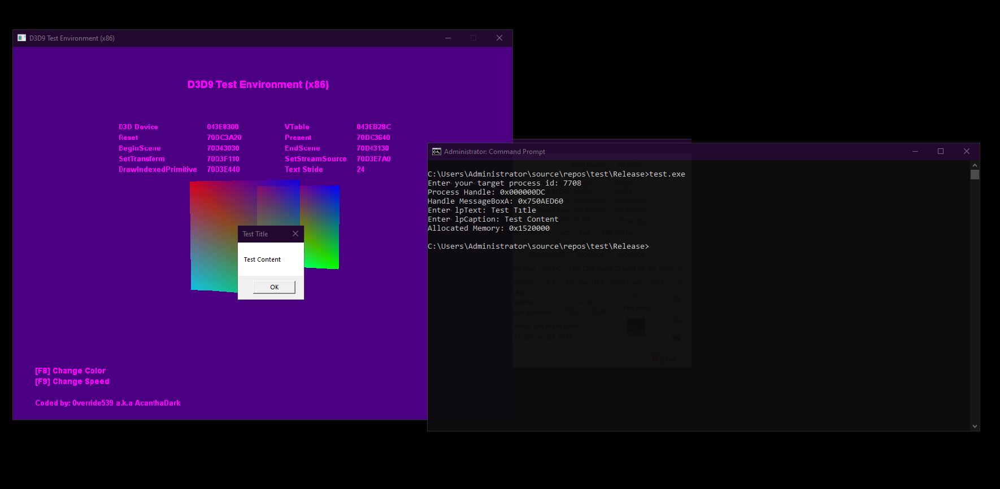

<h1 align="center">C++ Shellcode Injection</h1>



## About this project

We will understand how to inject the shellcode we have written using the "CreateRemoteThread" api.

## Requirements

- Beginner assembly x86 knowledge
- C/C++ knowledge
- CMAKE knowledge (optional for build this project)

## About shellcode in this project

```cpp
unsigned char shellcode[] = {
    0x6A, 0x00,                   // push   0x0             -> UINT    uType
    0x68, 0xFF, 0xFF, 0xFF, 0x00, // push   0xffffff        -> LPCTSTR lpCaption
    0x68, 0xFF, 0xFF, 0xFF, 0x00, // push   0xffffff        -> LPCTSTR lpText
    0x6A, 0x00,                   // push   0x0             -> HWND    hWnd
    0xB8, 0xFF, 0xFF, 0xFF, 0x00, // mov    eax,0xffffff    -> MessageBoxA PTR
    0xFF, 0xD0,                   // call   eax
    0x31, 0xC0,                   // xor    eax,eax
    0xC3                          // ret
};
```

This shellcode we wrote calls a function that takes 4 parameters. We want to see a message box in target app. When we examine the "messagebox" api, our shellcode is compatible. [Click for more information about MessageBoxA](https://docs.microsoft.com/en-us/windows/win32/api/winuser/nf-winuser-messageboxa)

## How to build&run this project

```bash script
git clone https://github.com/byRespect/cpp-shellcode-inject
cd cpp-shellcode-inject
cmake .
make
wine shellcodetest.exe
```

> :warning: : The project must be compiled in x86 architecture. And the target application must be in x86 architecture.

## References

- [defuse.ca](https://defuse.ca/online-x86-assembler.htm) for assembly to byte or byte to assembly.
